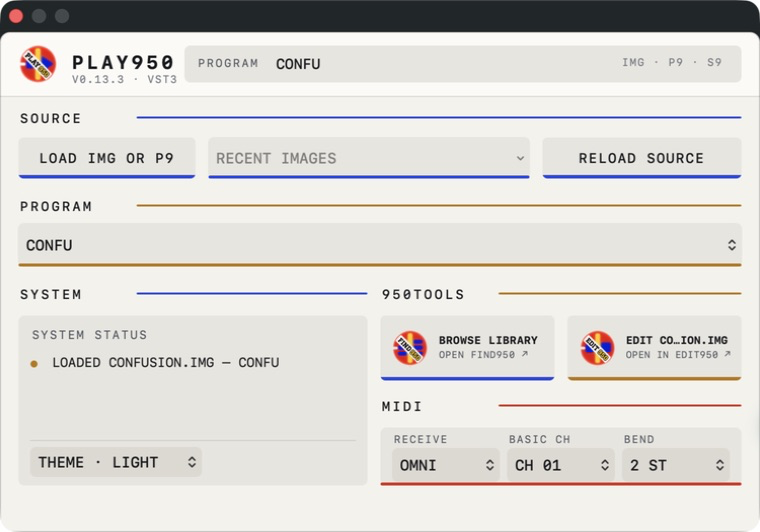

# PLAY950

<p align="center">
  
</p>

<p align="center"><strong>LOAD · PLAY · RECALL</strong></p>

[](LICENSING.md)

## Play the programs inside your old S900/S950 disk images in a DAW

Your `.img` backups contain more than audio. They contain the P9 programs that
map samples across the keyboard, tune them, loop them, switch velocity
layers and route them to the sampler outputs. Exporting everything as WAV loses
that musical structure.

PLAY950 is a macOS VST3 instrument that loads the native program and its linked
S9 samples so the sample programs can be played from a MIDI track. When the DAW
project is saved, PLAY950 embeds the required native content in its plug-in
state. Reopening the project does not depend on the original IMG still being
mounted or living at the same path.

This is for musicians who:

- imaged old floppies with Greaseweazle or another preservation setup;
- copied an S900/S950 archive from a Gotek or USB collection;
- no longer own the sampler but still want to use its programs;
- want original keygroups, tuning and loops rather than a folder of WAVs; or
- want old sampler sounds to recall with a DAW; or
- enjoy the creative discipline of an 800 KB or 1.6 MB floppy: limited sample
  memory, limited directory slots and a small, deliberate palette of sounds.

You do **not** need the original hardware. If your preservation workflow
produced a compatible `.img`, PLAY950 can load from that image, read-only.

The floppy constraint can be the point rather than an inconvenience. Build a
small working IMG in EDIT950, decide what deserves the available
memory, and let that fixed disk become the sound palette for a track or live
set. PLAY950 brings the result into the DAW while preserving those choices.



*PLAY950 loads the native program and linked samples, then keeps the playable
content with the DAW project.*

## Current availability

PLAY950 **0.13.4** is the current
[public Universal macOS VST3 community build](https://github.com/richiewarburton/PLAY950/releases/latest)
for macOS 14 or later. Acceptance uses Ableton Live 12 and Steinberg's VST3
editor host and validator, although PLAY950 is designed around standard VST3
hosting.

PLAY950 models the supported S950 playback, filter and envelope behaviour. It is
not presented as a circuit-level or component-perfect hardware emulation.

## How to use PLAY950

For a fuller walkthrough with screenshots, installation help, routing advice
and troubleshooting, see the [PLAY950 musician's guide](docs/USER_GUIDE.md).

1. Install `PLAY950.vst3`, rescan plug-ins if necessary, and add PLAY950 to a
   MIDI/instrument track in the DAW.
2. Open the editor and choose **Open IMG or P9…**, or send a program from
   FIND950.
3. For an IMG containing several programs, choose the P9 from the program menu.
   PLAY950 resolves its linked S9 samples away from the audio thread.
4. Play it from MIDI. **Omni** preserves channel-agnostic playback. Select
   **KG Channels** and the S950 Basic MIDI Channel when a P9 uses keygroup
   channel offsets. Pitch bend is isolated per incoming MIDI channel; its range
   defaults to two semitones.
5. Route `All(00)` for the complete mix, or expose `Mono(01)`–`Mono(08)`,
   `Left(09)` and `Right(10)` in the host for the original output assignments.
6. Save the DAW project. PLAY950 embeds the current native program and samples
   so reopening does not depend on the source IMG path.
7. Use **Open in EDIT950** when you want to alter the image or program; PLAY950
   itself remains a read-only player.

The 0.13.3-and-later editor uses larger type throughout. Its **Theme** menu defaults to
the macOS System appearance, with explicit Light and Dark choices when a fixed
plug-in appearance is preferable in the DAW.

The source IMG is opened read-only. Loading a sound cannot rename, delete,
format or otherwise modify the archive.

PLAY950 has one MIDI event input and **no audio input buses or sampling
functionality**. It plays already-recorded native S9 content; it does not record,
monitor or pass through incoming audio.

### Multitimbral P9s in Renoise

Load PLAY950 once, then create Renoise Plugin Alias instruments for that VST3
instance. Set each alias to the MIDI channel needed by the P9 and use those alias
instrument numbers on any pattern tracks. In PLAY950, select **KG Channels** and
set the Basic Channel used when the program was authored (commonly channel 1).
All aliases then share one PLAY950 instance, one eight-voice pool and the same
S950 outputs. See Renoise's
[multi-timbral plugin instructions](https://tutorials.renoise.com/wiki/Plugin#Multi-Timbral_Plugins).

## What PLAY950 currently preserves

- P9 key ranges and Soft/Loud velocity layers;
- P9 keygroup MIDI-channel offsets relative to a selectable Basic Channel;
- per-channel note release and pitch bend for multitimbral playback;
- native sample assignments and root-note tuning;
- forward and reverse playback;
- one-shot, normal and alternating/ping-pong loops;
- P9 One Shot and Constant Pitch behaviour;
- amplitude and VCF envelopes;
- layer/sample loudness, velocity-to-loudness, VCF-envelope amount,
  velocity-to-filter and Key-filter controls;
- the selected program from a multi-program IMG; and
- the complete program/sample collection in versioned DAW project state.

The player has an eight-voice global pool and exposes the S950-style `All(00)`,
`Mono(01)`–`Mono(08)`, `Left(09)` and `Right(10)` mono buses. Individual Mono
voices are also fed to their Left/Right group and the All mix.

## IMG and Greaseweazle notes

- A normal S900/S950 `.img` copy is the intended input.
- Raw flux captures, `.scp` and `.hfe` files are not loaded directly. Keep those
  archival masters and export or convert a compatible IMG copy first.
- PLAY950 does not read or write physical floppy drives.
- IMG extraction uses the bundled AKAI Util helper in read-only mode and runs
  outside the real-time audio thread.
- Private hardware/native-format fixtures are deliberately excluded from this
  public repository.

AKAI Util 4.6.7 is included with PLAY950. No separate download, EDIT950
installation, path selection, `chmod` command or other Terminal setup is
required. PLAY950 launches the included Universal helper locally and read-only
only when loading an IMG. Direct P9/S9 parsing, playback and saved-project recall
are native and do not use AKAI Util.

## Build and install the development plug-in

Install Xcode, then clone with the pinned Steinberg VST3 SDK submodules:

```sh
git clone --recurse-submodules https://github.com/richiewarburton/PLAY950.git
cd PLAY950
cmake -S . -B build -G Xcode \
  -DCMAKE_OSX_ARCHITECTURES="arm64;x86_64" \
  -DCMAKE_OSX_DEPLOYMENT_TARGET=14.0
cmake --build build --config Release --target PLAY950
```

Copy the resulting `PLAY950.vst3` to:

```text
~/Library/Audio/Plug-Ins/VST3/
```

Then restart or rescan plug-ins in the DAW. See [INSTALL.md](docs/INSTALL.md) and
[RELEASE.md](docs/RELEASE.md) for the current development-build, validation and
packaging details.

Run the public tests with:

```sh
cmake --build build --config Release --target \
  play950_format_tests \
  play950_p9_tests \
  play950_audio_tests \
  play950_program_audio_tests \
  play950_project_state_tests \
  play950_image_workflow_tests
ctest --test-dir build -C Release --output-on-failure
```

Extra genuine-file regressions activate automatically when the private local
fixture directory is present.

## Finding and editing sounds

PLAY950 is the playback part of the
[950TOOLS](https://github.com/richiewarburton/950TOOLS) workflow:

| Product | Job |
| --- | --- |
| [FIND950](https://github.com/richiewarburton/FIND950) | Search, tag and audition a whole IMG archive read-only. |
| [EDIT950](https://github.com/richiewarburton/EDIT950) | Inspect, edit and safely create or modify IMG/P9/S9 content. |
| **PLAY950** | Play native programs in the DAW and recall them with the project. |

> **Find in FIND950, modify in EDIT950, play and recall in PLAY950.**

The editor can launch the installed FIND950. FIND950's **Open
in PLAY950** action can ask an open editor to load the selected IMG and P9. EDIT950
can be opened from PLAY950 when the source image needs inspection or editing.

Keeping those responsibilities separate means the real-time instrument never
becomes an IMG editor and the catalogue never becomes an accidental disk writer.

## Technical scope

The native parsers document the supported clean-room P9/S9 subset in
[P9-FORMAT.md](docs/P9-FORMAT.md) and [S9-FORMAT.md](docs/S9-FORMAT.md).
[PRODUCT-SCOPE.md](docs/PRODUCT-SCOPE.md) records the intended hardware/DAW
boundary and [PROJECT-STATUS.md](docs/PROJECT-STATUS.md) records current
validation.

Release builds compile a Universal AKAI Util 4.6.7 helper from the vendored
source. Its GPL-2.0-or-later licence, provenance and corresponding source are
included under `external/akaiutil/`. The Steinberg VST3 SDK remains a pinned Git
submodule under its own licence.

## Licence

Current original PLAY950 material is source-available under the
[PolyForm Internal Use License 1.0.0](LICENSE), with
[additional permission](LICENSING.md) for personal, educational and internal
professional use—including paid music work. Distributing, bundling, hosting or
selling PLAY950 requires a separate written agreement from Richie Warburton.
Historical MIT versions retain their earlier terms.

This is an independent project and is not affiliated with or endorsed by Akai
Professional. AKAI Util, the Steinberg VST3 SDK, third-party tools, trademarks
and test media retain their respective rights.
