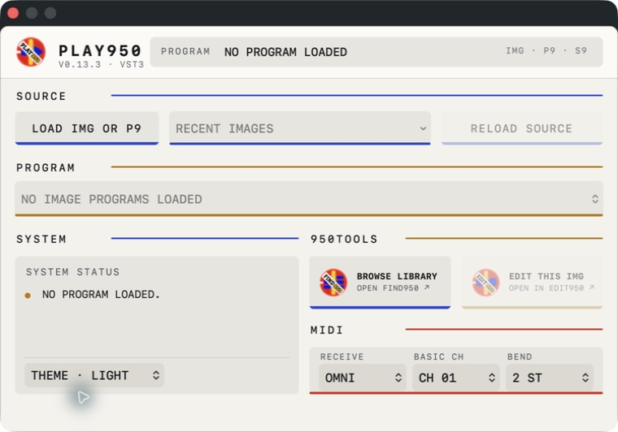
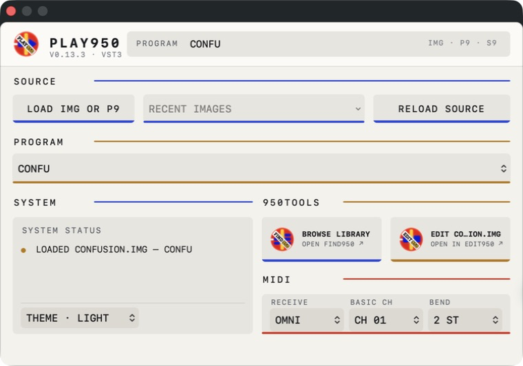
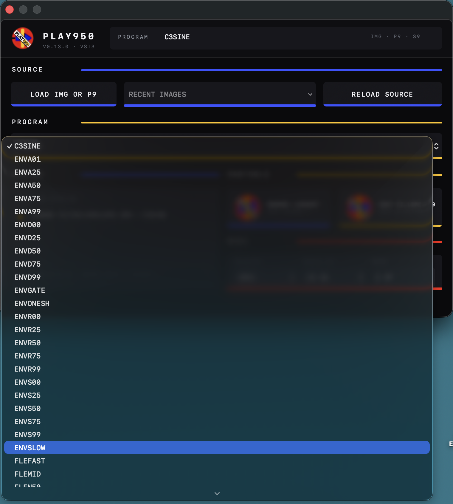

# PLAY950 musician’s guide

PLAY950 puts the programs from S900 and S950 disk images onto a DAW instrument
track. It keeps the original keyboard layout, layers, tuning, loops, envelopes
and output choices, then stores the loaded sound with the DAW project.

PLAY950 is a player. It does not record audio and it never changes your IMG.

This guide assumes macOS 14 or later and a VST3 host such as Ableton Live or
Renoise.

## Three old sampler terms you will see

| Label | What it means to a musician |
| --- | --- |
| **IMG** | A copy of a complete sampler disk. |
| **P9 program** | The playable instrument: keyboard zones, tuning, layers, envelopes and outputs. |
| **S9 sample** | One recording used by a program. |

## Install PLAY950

1. Download the latest Universal macOS ZIP from the
   [PLAY950 releases page](https://github.com/richiewarburton/PLAY950/releases/latest).
2. Quit the DAW.
3. Open the ZIP and copy `PLAY950.vst3` to:

   `~/Library/Audio/Plug-Ins/VST3/`

4. Reopen the DAW and rescan VST3 plug-ins if PLAY950 does not appear.
5. Add PLAY950 to a MIDI or instrument track.

The public community build is not Apple-notarized. macOS or the DAW may ask you
to approve it the first time it is scanned.

AKAI Util 4.6.7 is included inside PLAY950. No separate download, EDIT950
installation, path selection, `chmod` command or other Terminal setup is
required. PLAY950 uses it read-only only when loading an IMG; direct P9/S9
loading, playback and saved-project recall are native.

## Start with an empty player

*The forced Light appearance demonstrates the adaptive 0.13.3 palette and
larger editor type. Leave Theme on System to follow macOS automatically.*

The editor has four working areas:

- **Source** loads a disk or loose program and returns to recent disks.
- **Program** chooses which instrument to play when a disk holds several.
- **System Status** tells you what is loaded.
- **MIDI** chooses how the program responds to incoming channels and pitch bend.

The FIND950 and EDIT950 buttons are shortcuts into the rest of the suite.
PLAY950 uses substantially larger editor type in 0.13.3. The **Theme** menu in
System Status defaults to **System**, following the current macOS appearance;
choose **Light** or **Dark** when you want the plug-in to stay in one appearance
regardless of the Mac setting.

## Keyboard shortcuts

PLAY950 runs inside your DAW, so the DAW controls the computer keyboard. There
are no fixed PLAY950 computer-key shortcuts to learn. Use your DAW’s normal
keys for starting and stopping playback, recording, opening the plug-in window
and playing notes from the computer keyboard.

If a DAW shortcut does not work while the PLAY950 window is open, click back on
the DAW’s main window and try it again.

## Load your first sound

1. Click **Load IMG or P9**.
2. Choose an `.img` disk image or a loose `.P9` program.
3. If you chose a P9, keep its S9 samples in the same folder so PLAY950 can find
   them.
4. Play a MIDI keyboard or a clip on the track.

*A current 0.13.3 editor-host capture with a native IMG program loaded. The
source remains read-only.*

The yellow dot and **Loaded** message confirm that the sound is ready. The
program name also appears at the top of the editor.

Loading happens away from the audio path. If a load fails, the sound that was
already playing stays available instead of being replaced by silence.

## Choose a program from a disk

Some IMG disks hold one program; others hold many. Open the **Program** menu and
choose the one you want.

Changing the program keeps you on the same disk and loads the samples linked to
that P9.

Use **Recent Images** to return to a disk you used earlier. Use **Reload Source**
after editing the IMG in EDIT950.

## Get MIDI responding the way you expect

For most sounds, leave **Receive** set to **Omni**. Any incoming MIDI channel can
play the program.

Choose **KG Channels** only when the original program deliberately used
different MIDI channels for different keyboard zones. Then set **Basic Ch** to
the channel the program was built around.

Set **Bend** to the pitch-bend range you want. Two semitones is the familiar
default for most playing.

If notes arrive but the wrong zones play, return to **Omni** first. It is the
quickest way to separate a channel-setting problem from a missing-sample
problem.

## Route the original outputs in the DAW

PLAY950 offers the S950-style outputs as separate mono buses:

- **All (00)** — the complete mix;
- **Mono (01)–Mono (08)** — the eight individual outputs;
- **Left (09)** and **Right (10)** — the original left/right assignments.

For a quick start, use **All (00)** only. When you want separate processing,
enable PLAY950’s extra outputs in the DAW and route them to their own mixer
channels.

This is useful for putting different drums through different effects while
keeping the program’s original output assignments.

## Save the sound with the song

Save the DAW project normally. PLAY950 stores the loaded program and samples in
its plug-in state.

That means the project can recall the sound even if:

- the original IMG moves to another folder;
- the external drive is disconnected; or
- you deliberately archive the source somewhere else.

Keep the original IMG backed up anyway. The DAW copy is for recalling the song,
not replacing the archive.

## Move between FIND, EDIT and PLAY

### Browse Library

Click **Browse Library** to open FIND950. Use it when you know the kind of sound
you want but not which disk contains it.

FIND950 can also send a chosen P9 directly to an open PLAY950 editor.

### Edit This IMG

Click **Edit This IMG** to open the loaded disk in EDIT950. Make the change
there, return to the DAW, then click **Reload Source**.

PLAY950 never writes to the disk itself. That keeps file editing out of the
real-time instrument.

## Use a multitimbral program in Renoise

When one P9 uses several MIDI channels:

1. Load one PLAY950 instance.
2. Set **Receive** to **KG Channels**.
3. Set the correct **Basic Ch**.
4. Create Renoise Plugin Alias instruments for the PLAY950 instance.
5. Give each alias the MIDI channel needed by the part.

The aliases share the same loaded disk, eight-voice pool and S950-style outputs.

## What PLAY950 is—and is not

PLAY950 does:

- play existing S9 samples through their P9 keyboard maps;
- respond to MIDI notes, release and pitch bend;
- reproduce the supported loops, layers, envelopes, filter behaviour and
  output choices; and
- recall the loaded sound with the DAW project.

PLAY950 does not:

- record or sample incoming audio;
- monitor an audio input;
- edit or format an IMG; or
- claim to be a component-for-component electronic copy of an S950.

It is meant to recover the musical behaviour of the programs, not to turn the
DAW into a sampler repair bench.

## Check for updates

PLAY950 checks the latest GitHub release whenever its editor opens. If a newer
version exists, a compact update button appears in the System panel and opens
the GitHub release page. There is no automatic download or installation. Quit
the DAW before replacing `PLAY950.vst3`, then rescan or reopen the host.

## Quick fixes

### PLAY950 does not appear in the DAW

Check that `PLAY950.vst3` is inside `~/Library/Audio/Plug-Ins/VST3/`, then force
a VST3 rescan. Quit and reopen the DAW after installing.

### The plug-in loads but makes no sound

- Put MIDI notes on the PLAY950 track or arm it for live input.
- Start with **Receive: Omni**.
- Check that the DAW is listening to **All (00)**.
- Confirm that System Status says **Loaded** rather than showing an error.

### A loose P9 will not load

Put the S9 samples it uses in the same folder. If you do not know which samples
are missing, open the P9 in EDIT950 or locate the original disk in FIND950.

### Open in PLAY950 from FIND950 does nothing

Leave the PLAY950 editor window open in the DAW, then send the program again.

### Reload Source reports a failure

The previous sound remains loaded. Check that the IMG still exists and opens in
EDIT950, then try again.

### The program reacts strangely to MIDI channels

Switch **Receive** back to **Omni**. Use **KG Channels** only for programs that
were intentionally built around channel offsets.

## A simple musical workflow

1. Add PLAY950 to an instrument track.
2. Load an IMG.
3. Choose a program and play it from MIDI.
4. Use **All (00)** for the first pass.
5. Save the DAW project.
6. If the sound needs work, open the IMG in EDIT950 and reload it afterwards.
7. If you need a different sound, browse the archive in FIND950 and send it to
   the open PLAY950 editor.

The important bit is simple: once the program feels right, save the song and
PLAY950 keeps that playable version with it.
